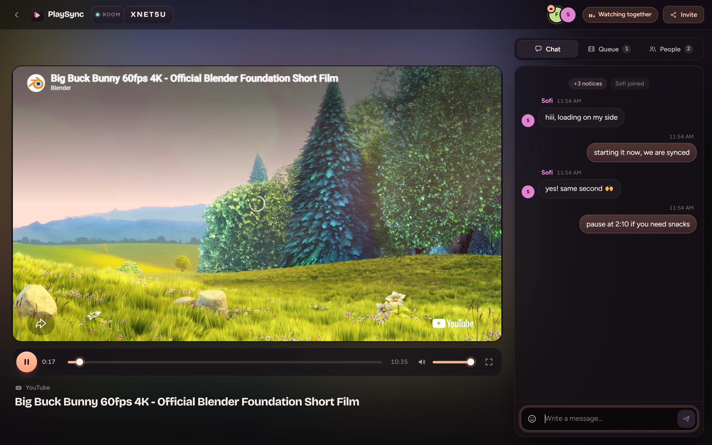
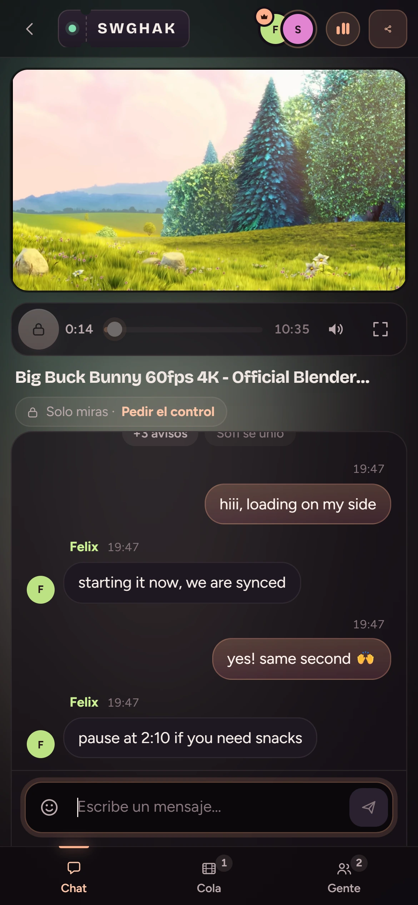
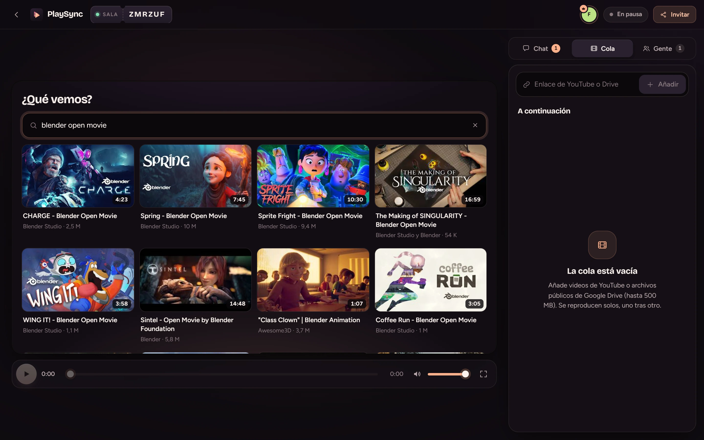
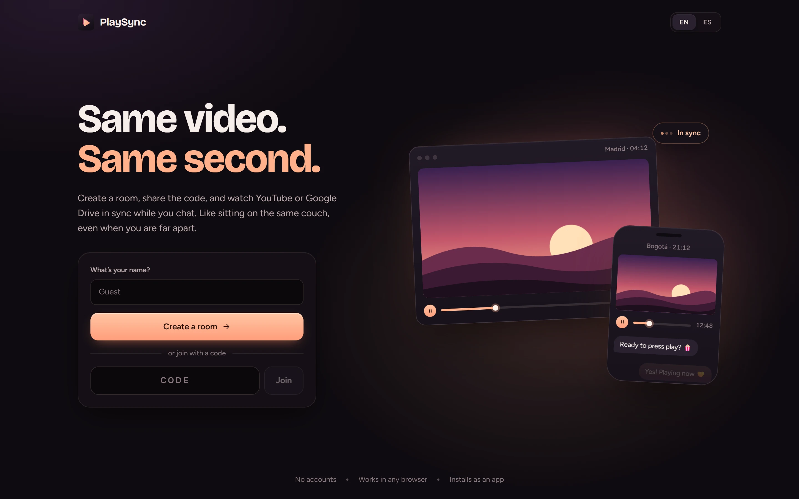

# PlaySync

Watch YouTube or a public Google Drive video in sync with people on other devices: create a room, share a six-character code, and play, pause and seek stay aligned for everyone while you chat.

**[Live demo](https://syncplay-avtu.onrender.com)** · **[Case study](https://anderssonfelix.com/work/playsync/)** · **Author: [Felix Andersson](https://anderssonfelix.com)**

> The demo runs on a free Render instance that sleeps when idle, so the first load can take up to a minute.



## What it is

PlaySync is a watch party for two or three people in different places, on any mix of phones and computers. There are no accounts and nothing to install: open the site, create a room and send the link (`#/r/CODE`). It also installs as a Progressive Web App on Android, iOS and desktop. The interface is in English by default, with a Spanish version (an EN / ES switch on the landing page and in the room's People panel); code and docs are in English.

YouTube video never passes through the server. Each client plays the official YouTube embed directly, and the server only holds the room's state and relays small JSON messages over one WebSocket. The server owns the playback clock and every client keeps steering its own player toward it, which is where most of the work is: keeping a phone on mobile data and a desktop on Wi-Fi within a second or two of each other through buffering, background tabs, autoplay blocks and reconnects.

<table>
  <tr>
    <td width="260" valign="top">
      
      <br><sub>The same room on the guest's phone, a second later (0:14). Guests watch by default and can ask the host for control.</sub>
    </td>
    <td valign="top">
      
      <br><sub>Search replaces the player when nothing is playing. No API key needed.</sub>
      <br><br>
      
      <br><sub>Landing: pick a name, create a room or join with a code.</sub>
    </td>
  </tr>
</table>

## Features

- **Room-wide playback**: play, pause, seek and end of video apply to everyone; the queue advances by itself.
- **Rooms by code**: six characters from an alphabet without look-alikes (no `0/O`, `1/I/L`), shareable as a link. No sign-up.
- **Roles**: whoever opens the room hosts it. The host grants or revokes control per person or lets everyone control; viewers can ask for control and the host gets a one-tap prompt.
- **Queue** from YouTube links (`watch`, `youtu.be`, `shorts`, `live`, `embed`) and public Google Drive video files.
- **YouTube search** inside the player for people with control: shown when nothing is playing, after the last video ends, or when a video refuses to be embedded.
- **Chat** with system notices (joins, leaves, what's playing), an emoji picker with per-user recents, and Giphy GIFs and stickers with search and recents.
- **Floating reactions**: GIFs, stickers and emoji-only messages float over the video for everyone, fullscreen included.
- **Screen light**: the playing YouTube video's colors glow behind the room, following the picture through YouTube's seek-preview frames, with the thumbnail as a fallback.
- **Name prompt**: someone who opens a room link without a name is asked for one on arrival, and can skip as Guest.
- **Custom controls** (YouTube's own chrome is hidden) and a "tap to join with sound" overlay when the browser blocks autoplay, as iOS does.
- **Installable PWA** with a manifest, an auto-updating service worker and generated icons.
- **Responsive layout**: bottom tab bar on phones; video and a side panel next to each other from 940px wide, or in landscape from 520px.

## How sync works

**The server owns the clock.** For each room, `server/index.ts` stores the source (`videoId` or a Drive `media` item), `isPlaying`, `position` and `lastUpdatedAt` in its own clock. The effective position is `position + (now - lastUpdatedAt)` while playing. Every change goes through `commit()`, which first rebases `position` to the effective position, so play, pause and seek never lose time. Every `state` message carries `serverTime`, and the server re-broadcasts state every 5 s even when nobody acts. When the last person leaves, the room pauses and freezes its position, so returning resumes where it stopped.

**Each client estimates the server clock.** `src/lib/sync.ts` pings on connect and every 8 s and computes `offset = t1 - (t0 + rtt / 2)` (NTP-style). Samples with a round trip of 5 s or more are discarded, because a throttled background tab can process a pong minutes late. On a dropped connection it reconnects with exponential backoff (0.5 s doubling to 8 s, with jitter), rejoins, and receives the full state, chat and participant list in the `welcome` message.

**A reconcile loop steers the local player** (`src/components/Player.tsx`). It extrapolates the target position onto the server clock and compares it with the player. It runs on every state message (throttled to once per 250 ms), every 4 s, and forced when the tab becomes visible again, at which point the client also sends a `sync-request`.

| Situation | What the client does |
| --- | --- |
| Room playing, local player stopped | Seek if drift exceeds 1 s, then play |
| Room playing, local player playing | Seek if drift exceeds 1.5 s, at most once every 2.5 s unless drift exceeds 8 s |
| Room paused | Pause; seek only if drift exceeds 4 s |
| The user just played, paused or seeked | Trust the local action for 2.5 s, until the server echoes it back |
| Player still not started 1.4 s after a sync play | Show the "tap to join with sound" overlay (autoplay policy) |

The same loop drives a native `<video>` element for Drive files. End of video is reported by clients at most once every 5 s, and the server ignores repeats within 3 s, so two clients finishing together advance the queue once.

## How it's built

**Roles are enforced on the server.** Every intent that changes playback or the queue is in `CONTROL_INTENTS`; the server checks the sender's role and answers a viewer with a `forbidden` error instead of trusting the UI. The host is identified by a stable per-browser id (kept in `localStorage`, never sent to other clients), so the role survives reloads. If the host is gone for more than a minute, the role passes to the person who has been in the room longest. Control requests are limited to one every 20 s per person.

**Google Drive files go through a streaming proxy.** `/api/media/:fileId` resolves a public Drive file to a direct download URL, replaying Drive's virus-scan confirmation form when it appears, and caches the result for 30 minutes. It forwards the browser's `Range` header, so seeking works, and re-resolves once if Google's time-limited URL has expired. A watchdog closes the connection if Google stops sending for 12 s, so the browser re-requests the range instead of hanging. Nothing is stored on the server.

- Files above `MAX_MEDIA_MB` (default 500) are rejected with a clear message. The file must be shared as "Anyone with the link"; Drive may throttle heavily downloaded files (`DRIVE_QUOTA`) until the next day.
- Unlike YouTube, these bytes do flow through the server: Google to server to each viewer. A 500 MB file watched by two people costs about 1 GB of egress, which matters on a free hosting tier.

**YouTube search without a key.** `/api/youtube/search` reads the data embedded in YouTube's own results page and caches each query for 15 minutes. If that stops working, setting `YOUTUBE_API_KEY` makes the server fall back to the YouTube Data API v3 (100 quota units per search, 10,000 per day free).

**Giphy through the server.** The client calls `/api/giphy/*` on its own server, so the key never reaches the browser; search results are cached 10 minutes and trending 30. Without `GIPHY_API_KEY` everything else works and the GIF and sticker tabs show setup instructions.

**Hardening**

- WebSocket frames are capped at 16 KB; malformed messages are dropped and handler errors are caught per message.
- All input is normalized: room codes, 11-character video ids, Drive file ids, names (24 chars), titles (200), chat messages (500).
- Chat is rate-limited to 6 messages per 3 s per connection, and each room keeps its last 100 messages.
- Chat media must be `https` on `*.giphy.com`, so the chat can't be used to embed arbitrary images.
- The static file server rejects path traversal; hashed assets are served as immutable.
- Dead connections are found with a WebSocket ping every 30 s; empty rooms are deleted after 2 hours.

**Where to look**

| Path | What's there |
| --- | --- |
| `shared/protocol.ts` | Message types shared by server and client |
| `server/index.ts` | Rooms, roles, sync state, HTTP API, Drive proxy, static files |
| `src/lib/sync.ts` | WebSocket client, clock offset, reconnection |
| `src/components/Player.tsx` | YouTube and `<video>` players, reconcile loop, controls |
| `src/hooks/useRoom.ts` | Room state and actions for the UI |
| `scripts/smoke.mjs` | Two-client protocol test |

## Stack

- **Server**: Node 20+, [`ws`](https://github.com/websockets/ws), TypeScript run with `tsx`. One process serves the static build, `/api/*` and `/ws` on the same port. Room state lives in memory.
- **Client**: React 19, Vite 6, TypeScript, the YouTube IFrame Player API, `vite-plugin-pwa` (Workbox). Hand-written CSS, no UI library.

## Getting started

Requires Node 20 or newer.

```bash
npm install
npm run dev        # server on :3001 (tsx watch) + Vite on :5173, proxying /ws and /api
```

Open http://localhost:5173. Everything works without configuration except GIFs and stickers.

Optional environment variables. For local development put them in a `.env` file at the repo root (see `.env.example`); the server reads it at startup.

| Variable | Purpose |
| --- | --- |
| `GIPHY_API_KEY` | Enables GIFs and stickers. Free key from [developers.giphy.com](https://developers.giphy.com) (Create an App, API). |
| `YOUTUBE_API_KEY` | YouTube Data API v3 fallback for search, only used if keyless search fails. |
| `MAX_MEDIA_MB` | Size limit for Drive files. Default `500`. |
| `PORT` | Server port. Default `3001`. |
| `API_PORT` | Dev only: where Vite proxies `/ws` and `/api`. Default `3001`. |

Other scripts:

```bash
npm run check      # type-check client and server
npm run build      # production build: dist/, service worker, manifest
npm start          # serve everything from one process at http://localhost:3001
npm run icons      # regenerate public/icons/*.png from the logo (uses sharp)
```

## Deploy

Any host that runs Node and supports WebSockets works, since it is a single process. A [`render.yaml`](render.yaml) blueprint is included: a free web service with build `npm install && npm run build`, start `npm start`, health check on `/api/health`, Node 20 and `MAX_MEDIA_MB=500`. Set `GIPHY_API_KEY` (and optionally `YOUTUBE_API_KEY`) in the service's Environment settings.

On a VPS: `npm run build && PORT=8080 npm start` behind nginx with TLS.

Installing the app and the service worker require HTTPS (or `localhost`); Render provides HTTPS by default. To install: Chrome on Android, menu then "Install app"; Safari on iPhone, Share then "Add to Home Screen"; Chrome or Edge on desktop, the install icon in the address bar.

## Testing

`scripts/smoke.mjs` connects two WebSocket clients to a running server and walks through the protocol:

```bash
npm start          # in one terminal
npm run smoke      # in another
```

It checks join and system notices, chat and GIF propagation, rejection of non-Giphy media, load, play and seek propagation, the ping/pong clock exchange, that the effective position extrapolates correctly after 1.5 s, queue add and auto-advance, the ended state, that the room's creator hosts and a joiner only watches, that a viewer's `play` is refused, that the host receives a control request, and that a granted viewer can play. It also checks that the Drive endpoint answers an invalid file id with a JSON error. `SMOKE_URL`, `SMOKE_HTTP` and `SMOKE_ROOM` point it at another server or room. It tests the protocol and server; it does not drive a real browser player.

## Known limitations

- Videos whose owner disabled embedding can't play; the room shows a notice, and whoever has control gets the search screen to pick another.
- YouTube ads show as in any embed and are not skipped.
- Rooms and chat live in memory: a restart empties them, and the app runs as a single instance.
- A room code is the only access control: anyone with the code can join as a viewer.

A possible next step is voice chat in the room over WebRTC.
